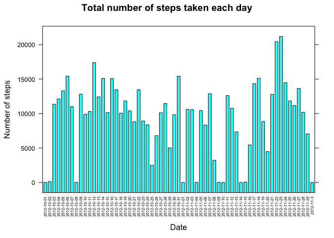

# Reproducible Research: Peer Assessment 1


## Loading and preprocessing the data

```r
library(dplyr)
```

```
## 
## Attaching package: 'dplyr'
```

```
## The following objects are masked from 'package:stats':
## 
##     filter, lag
```

```
## The following objects are masked from 'package:base':
## 
##     intersect, setdiff, setequal, union
```

```r
library(lattice)
# Read the data into a data.frame by read.csv.
# Add a new column "Time" indicating the full time in POSIXlt format for the row.
if(!file.exists("activity.zip")){
  fileUrl <- "https://d396qusza40orc.cloudfront.net/repdata%2Fdata%2Factivity.zip"
  download.file(fileUrl, destfile = "activity.zip", method = "curl")
  unzip("activity.zip")
}
activity <- read.csv( "activity.csv")
activity <- mutate(activity, Time = strptime( paste(date, "00:00:00"), format = "%Y-%m-%d %H:%M:%S") + 60 * interval )
```
## What is mean total number of steps taken per day?

```r
# Group the data by date, and summarize it for the histogram.
activity <- group_by( activity, date)
steps_per_day <- summarize( activity, total_steps = sum(steps, na.rm = TRUE))
barchart(total_steps ~ date, steps_per_day, main = "Total number of steps taken each day", ylab = "Number of steps", scale = list(x=list(abbreviate = TRUE, rot = 90, cex = 0.5) ) )
```

<!-- -->

```r
# Calculate the median and mean of the data.
steps_median <- median( steps_per_day$total_steps, na.rm = TRUE)
steps_avg <- mean( steps_per_day$total_steps, na.rm = TRUE)
print( paste( "The mean of the total number of steps taken per day is", steps_avg))
```

```
## [1] "The mean of the total number of steps taken per day is 9354.22950819672"
```

```r
print( paste( "The median of the total number of steps taken per day is", steps_median))
```

```
## [1] "The median of the total number of steps taken per day is 10395"
```
## What is the average daily activity pattern?

```r
# Group the data by interval, summarize it for plot.
activity <- ungroup(activity)
activity <- group_by(activity, interval)
steps_per_intv <- summarize( activity, avgStepsByDays = mean(steps, na.rm = TRUE))
with(steps_per_intv, plot(interval, avgStepsByDays, type = "l", main = "", xlab = "", ylab = ""))
title(main = "Avg Steps of Interval Across All days", xlab = "Interval(min)", ylab = "Number of Step")
```

<!-- -->

```r
# Finding the 5-minutes interval with the max steps by filter.
interval_with_max_AvgSteps <- filter(steps_per_intv, avgStepsByDays == max(avgStepsByDays))[[1]]
print(paste("interval",interval_with_max_AvgSteps, "on average across all the days in the dataset, contains the maximum number of steps") )
```

```
## [1] "interval 835 on average across all the days in the dataset, contains the maximum number of steps"
```
## Imputing missing values

```r
# fill_na imputes the missing value of the original dataset by mean of that intercal accross all days.
# the mean value already calculated in previous step, stored in data.frame steps_per_intv
fill_na <- function(dfna, df, nacol = "steps",fillcol = "avgStepsByDays", by = "interval"){
    rows <- nrow(dfna)
    for( n in 1:rows){
        if( is.na( dfna[nacol][n,][[1]]) ){
            intv <- dfna[by][n,][[1]]
            dfna[nacol][n,][[1]] <- filter(df, df[by] == intv )[fillcol][[1]]
        }
    }
    dfna
}
num_na <- count(activity, is.na(steps))[[2]][2]
print(paste("total number of missing values in the dataset is", num_na))
```

```
## [1] "total number of missing values in the dataset is 2304"
```

```r
activity_nna <- fill_na(activity, steps_per_intv)
activity_nna <- group_by( activity_nna, date)
steps_per_day_nna <- summarize( activity_nna, total_steps = sum(steps, na.rm = TRUE))
barchart(total_steps ~ date, steps_per_day_nna, main = "Total number of steps taken each day(imputing missing values)", ylab = "Number of steps", scale = list(x=list(abbreviate = TRUE, rot = 90, cex = 0.5) ) )
```

<!-- -->

```r
#Computing the mean and median number with the missing value filled.
steps_median_nna <- median( steps_per_day_nna$total_steps, na.rm = TRUE)
steps_avg_nna <- mean( steps_per_day_nna$total_steps, na.rm = TRUE)
print( paste( "The mean of the total number of steps taken per day is", steps_avg_nna))
```

```
## [1] "The mean of the total number of steps taken per day is 10766.1886792453"
```

```r
print( paste( "The median of the total number of steps taken per day is", steps_median_nna))
```

```
## [1] "The median of the total number of steps taken per day is 10766.1886792453"
```

```r
print("Imputting the missing date make the mean and median steps per day equal.")
```

```
## [1] "Imputting the missing date make the mean and median steps per day equal."
```
## Are there differences in activity patterns between weekdays and weekends?

```r
# line 70 to 73 create a new column to indicate if the current date a weekday or weekend.
activity_nna <- mutate( activity_nna, DayType = weekdays(Time) )
weekendBool <- activity_nna["DayType"] == "Sunday" | activity_nna["DayType"] == "Saturday"
activity_nna$DayType[weekendBool] <- "weekend"
activity_nna$DayType[!weekendBool] <- "weekday"
# Group the data with interval and Daytype.
activity_nna <- ungroup(activity_nna)
activity_nna <- group_by( activity_nna, interval, DayType)
steps_per_intv <- summarize( activity_nna, avgStepsByWDays = mean( steps ) )
# Use xyplot from lattice to create the output picture with two panel, weekend and weekday respectively.
# Some points in the range of 300~500 are dissconected because of the avarage steps for the interval is zero, thus the log of
# which is minus infinite.
xyplot(avgStepsByWDays ~ interval | DayType, steps_per_intv, layout = c(1,2), type = "l", ylab = "Number of steps")
```

<!-- -->
